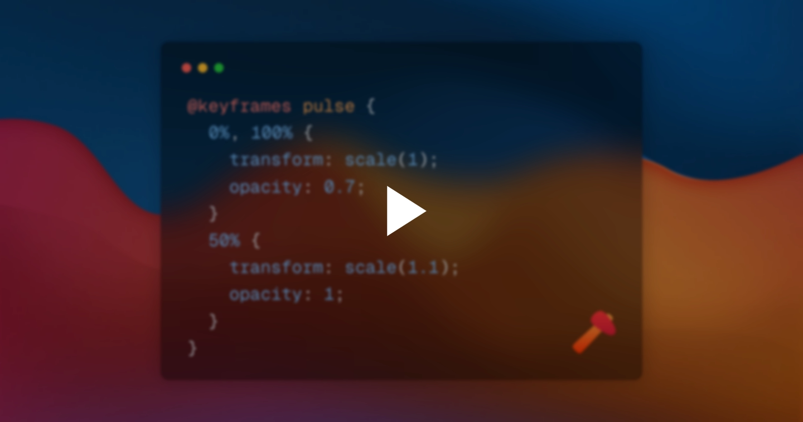

# ffmpeg-h265 Example

[](output/animation.mp4)

Render CSS **keyframe animations** with Takumi and encode them into an **H.265 (HEVC) MP4** file using ffmpeg.

## How It Works

1. A scene is built once with CSS `@keyframes` declared in a stylesheet string.
2. For each frame `i` the renderer is called with:

   ```ts
   timeMs = (i / fps) * 1000;
   ```

   This advances the CSS animation clock by exactly one frame period, so `animation-duration`, `animation-delay`, `animation-iteration-count`, etc. all work as expected.

3. `render()` is called with `format: "raw"` which returns raw RGBA pixels.
4. Each frame buffer is written directly to ffmpeg's stdin.
5. ffmpeg encodes the stream to H.265 (`libx265`) and writes the output MP4.

## Prerequisites

- [Bun](https://bun.sh)
- [FFmpeg](https://ffmpeg.org) with `libx265` support

## Usage

```bash
bun install
bun src/index.ts
```

The output video will be written to `output/animation.mp4`.

## Credits

Photo by Martin Martz on Unsplash
